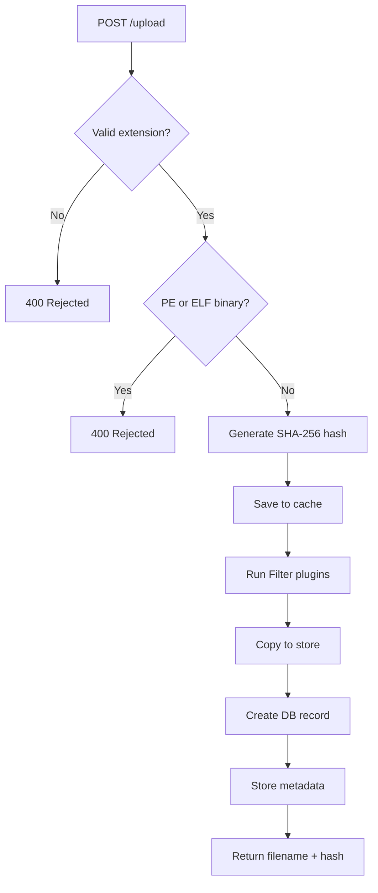
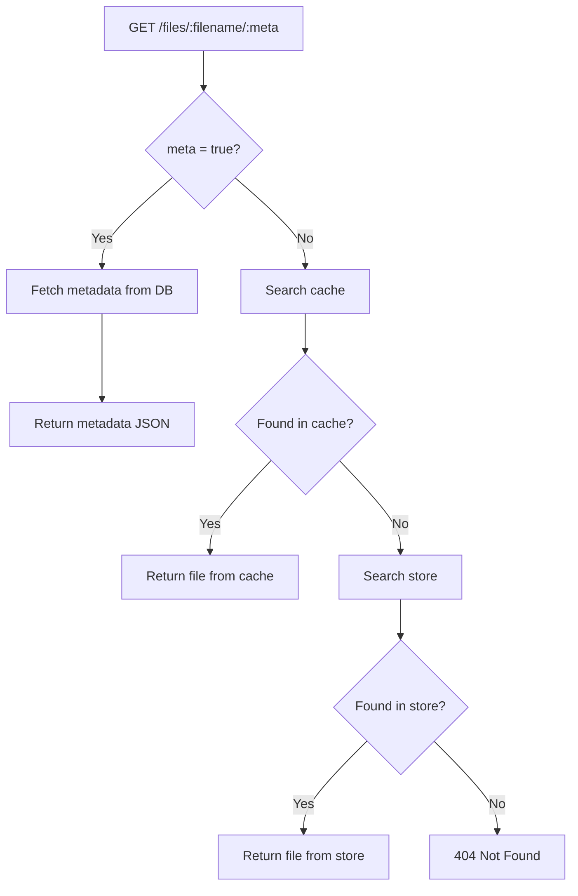

# Dewey

### Overview

Dewey is a backend file storage and management system exposing a RESTful API. Each uploaded file generates a database record containing ACTS claim metadata, a SHA-256 integrity hash, and decoded barcode data. Speed and low resource consumption on minimal hardware are primary design goals.

---

### Features

- File upload with extension allowlist and 50 MB size cap
- PE and ELF binary detection and rejection
- SHA-256 hash generation and verification per upload
- Barcode scanning — decoded data stored in DB and visible to plugins
- ACTS metadata extraction and storage in a dedicated DB table
- Cache layer with persistent store fallback for fast retrieval
- Self-backups for rollbacks
- HTTP rate limiting (1 req/s, burst of 5)
- Prometheus metrics and custom graphing
- Admin portal and settings UI
- Lua plugin system (Init, Filter, Script, Tick hooks)
- Background daemon that fires Tick plugins on a configurable interval
- Built-in test suite (BITs) that runs automatically at startup

---

### API Reference

| Method | Endpoint | Description |
|--------|----------|-------------|
| `GET` | `/` | Health check — returns server status and Unix timestamp |
| `GET` | `/admin` | Admin portal UI |
| `GET` | `/settings` | Settings page UI |
| `POST` | `/upload` | Upload a file with ACTS metadata |
| `GET` | `/files` | List all files in cache |
| `GET` | `/files/:filename/:meta` | Retrieve a file; set `:meta` to `true` for metadata only |
| `DELETE` | `/files/:filename` | Delete a file |
| `GET` | `/admin/dumpCache` | Trigger a manual cache dump |

---

### File Restrictions

| Category | Values |
|----------|--------|
| **Max size** | 50 MB |
| **Documents** | `.pdf` `.txt` `.doc` `.docx` `.xls` `.xlsx` `.csv` `.ppt` |
| **Images** | `.png` `.jpg` `.jpeg` |
| **Blocked** | PE binaries, ELF binaries, all other extensions |

---

### ACTS Metadata Fields

Supplied as multipart form values on upload:

| Field | Description |
|-------|-------------|
| `claim_number` | ACTS claim identifier |
| `claimant_name` | Full name of the claimant |
| `date_of_injury` | Date of injury |
| `employer` | Employer name |
| `adjuster` | Adjuster name |
| `support` | Support level |
| `claim_type` | Type of claim |
| `jurisdiction` | Jurisdiction |
| `policy_number` | Policy number |
| `acts_id` | ACTS system ID |

---

### Plugin System

Plugins are Lua scripts placed in the `plugins/` directory and loaded at startup. Four hook types are supported:

| Hook | When it runs |
|------|--------------|
| `init` | Once at startup, after all services initialize |
| `filter` | On every file ingest — can modify file data |
| `script` | General-purpose on-demand execution |
| `tick` | On each daemon tick (every 1 hour by default) |

---

### Technology Stack

**Backend — Go (Golang)**
Go's goroutine model handles concurrent uploads without degrading throughput. Static compilation and a minimal runtime make deployment straightforward.

**Frontend — Svelte**
Provides the admin portal and settings UI. Decoupled from the backend for independent maintenance and scaling.

**Database — MySQL**
Connection parameters are read from the `DB_DSN` environment variable.
Default: `root:dewey@tcp(127.0.0.1:3306)/deweyRecords`

#### External Libraries

| Library | Purpose |
|---------|---------|
| [Gin](https://github.com/gin-gonic/gin) | HTTP web framework and routing |
| [Gozxing](https://github.com/makiuchi-d/gozxing) | Barcode reading |
| [GopherLua](https://github.com/yuin/gopher-lua) | Lua VM for the plugin system |
| [go-gin-prometheus](https://github.com/zsais/go-gin-prometheus) | Prometheus metrics middleware |
| [go-sql-driver/mysql](https://github.com/go-sql-driver/mysql) | MySQL database driver |
| [golang.org/x/time](https://pkg.go.dev/golang.org/x/time/rate) | HTTP rate limiter |

---

### Container Stack

The application runs as a Podman pod with four containers:

| Container | Image | Port | Role |
|-----------|-------|------|------|
| `cross-doc-tool-dev` | `cross-doc-tool-dev` | `8080` | Go backend |
| `svelte-container` | `admin-portal` | `3000` | Svelte frontend |
| `dewey-mysql` | `mysql:latest` | `3306` | MySQL database |
| `dewey-prometheus` | `prom/prometheus:latest` | `9090` | Prometheus |

---

### Deployment

```bash
# Build and run all containers
./deploy.sh

# Or load a pre-built image archive
podman load -i dewey-pod-all.tar.gz
```

Set a custom database connection string:

```bash
export DB_DSN="user:password@tcp(host:3306)/deweyRecords"
```

---

### Ingest Flow



### Retrieval Flow


