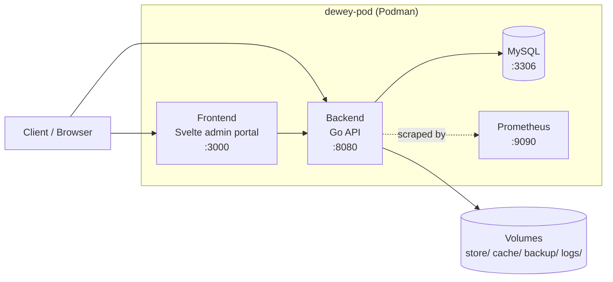
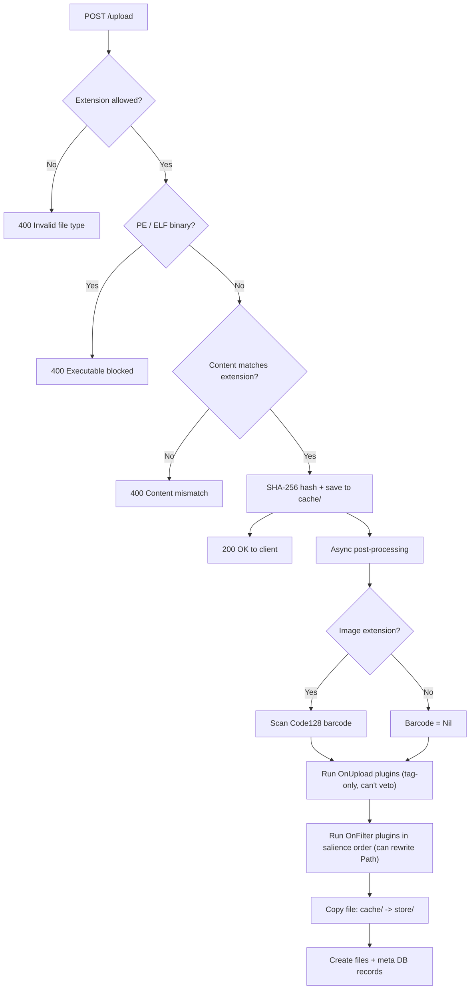
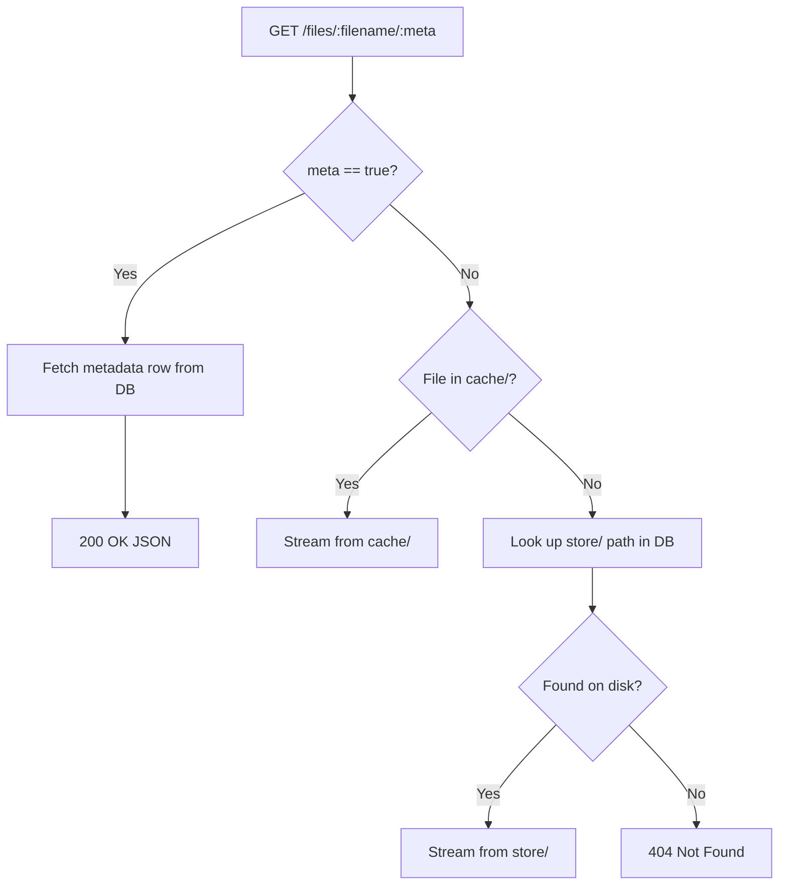
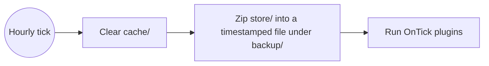

# Dewey

A backend file sorting and storage service with a RESTful API, built for stable operation on modest hardware.

## Table of Contents
- [Overview](#overview)
- [Features](#features)
- [Architecture](#architecture)
  - [Deployment Topology](#deployment-topology)
  - [Upload / Ingest Pipeline](#upload--ingest-pipeline)
  - [File Retrieval](#file-retrieval)
  - [Backup & Maintenance Daemon](#backup--maintenance-daemon)
- [API Reference](#api-reference)
- [Plugin System](#plugin-system)
- [Technology Stack](#technology-stack)
- [External Libraries](#external-libraries)
- [Testing](#testing)
- [Deployment & Packaging](#deployment--packaging)
- [Roadmap](#roadmap)

## Overview

Dewey ingests uploaded files, validates and sorts them, and exposes them again through a RESTful API. Every upload gets a database record tracking file identity, hash, storage path, and case metadata (claim number, claimant, employer, etc.). Speed and low resource overhead are priorities — the goal is a service that stays stable on the smallest hardware it can get away with.

## Features

**Ingest & Sorting**
- Extension allowlist (`pdf`, `txt`, `doc`/`docx`, `xls`/`xlsx`, `csv`, `ppt`, `png`, `jpg`/`jpeg`)
- Content-sniffing so a file's actual bytes must match its declared extension
- Windows PE / Linux ELF binary rejection
- SHA-256 hashing of every upload
- Code128 barcode scanning on image uploads
- Lua-based plugin pipeline for custom sorting/filtering logic, executed in salience order

**Security**
- IP allowlist ("known machines") gating every route, with per-request access logging as an audit trail
- Hard upload size ceiling enforced at the body-read level, not just multipart parsing
- Global HTTP rate limiting (token bucket)
- Files are served with `nosniff` and forced-download headers so stored content can't be executed by a browser

**Storage & Reliability**
- Two-tier storage: a fast `cache/` directory for recent uploads and a permanent `store/` directory
- Hourly daemon that zips `store/` into a timestamped archive under `backup/`
- Hourly cache clear to keep the fast-path directory small

**Observability & Administration**
- Prometheus metrics: uptime, memory/GC stats, file counts, upload rejections by reason, upload size distribution, barcode success/failure, plugin run/error counts, DB errors, and more
- Svelte-based admin portal: file browser, machine allowlist management, analytics/graphing, and in-app docs for both developers and administrators
- Structured, rotating logger

**Extensibility**
- Lua plugin system with a dynamic hook registry (`OnUpload`, `OnFilter`, `OnDelete`, `OnInit`, `OnTick`) — a plugin attaches to a hook simply by defining a function with that name
- (Planned) plugin validation
- (Planned) self restart and cleanup

## Architecture

### Deployment Topology

Dewey runs as four containers inside a single Podman pod, sharing a network namespace so they can reach each other over `localhost`.

### Upload / Ingest Pipeline

`POST /upload` validates and responds fast; hashing, barcode scanning, plugin sorting, and the permanent copy all happen afterward in the background so the client isn't kept waiting on them.

### File Retrieval

`GET /files/:filename/:meta` checks the fast cache before falling back to the permanent store looked up through the database.

### Backup & Maintenance Daemon

A background ticker (default interval: hourly, see `daemonTickTime` in `consts.go`) handles cleanup and backups without blocking the request path.

## API Reference

All routes below sit behind the IP-allowlist middleware (`known_machines`), which also logs every authorized request.

| Method | Path | Description |
|---|---|---|
| GET | `/` | Health check; returns a Unix timestamp |
| GET | `/version` | Reports the running app version and the git branch it was built from |
| GET | `/admin` | Admin portal page |
| GET | `/settings` | Settings page |
| POST | `/upload` | Upload, validate, hash, and queue a file for sorting |
| GET | `/files/:filename/:meta` | Stream a file (`meta=false`) or return its metadata as JSON (`meta=true`) |
| GET | `/files` | List files currently sitting in `cache/` |
| DELETE | `/files/:filename` | Remove a file's `store/` copy and mark its DB record deleted |
| GET | `/admin/dumpCache` | Trigger an async clear of `cache/` |
| GET | `/machines` | List machines on the IP allowlist |
| POST | `/machines` | Add a machine to the IP allowlist |
| DELETE | `/machines/:ip` | Remove a machine from the IP allowlist |

## Plugin System

Sorting and filtering logic is written in Lua rather than hardcoded in Go, so it can change without a rebuild. Plugin files live in `backend/plugins/` and are loaded from `pluginDir` at startup, against a dynamic registry of hook names Go registers up front (`main.go`) — there's no fixed set of plugin "types" baked into the loader.

Every plugin declares a `WhoAmI()` function returning its salience only. Which hook(s) it attaches to comes from the global functions it defines: a file attaches to a hook by defining a function with that hook's exact name (e.g. `OnFilter(entry)`), and a single file can implement more than one hook. Each such function receives the file's DB entry as a Lua table and returns the (possibly modified) table back.

| Hook | Runs | Notes |
|---|---|---|
| `OnUpload` | Once per upload, during async post-processing, before `OnFilter` | Fires after the `200 OK` is already sent, so it can't veto the upload — tag-only (e.g. write into `Meta`) |
| `OnFilter` | Once per upload, during async post-processing | Can rewrite the file's destination `Path` |
| `OnDelete` | Once per delete request, synchronously, before anything is removed | Calling `error(...)` vetoes the deletion — the caller gets a `403` instead |
| `OnInit` | Once at server startup | Registered and invoked; no shipped example plugin |
| `OnTick` | Once per daemon tick | Registered and invoked; no shipped example plugin |

Within a hook, plugins run in descending salience order (highest first), each in its own isolated Lua state (via a per-plugin `sync.Pool`) so one plugin's globals can't leak into another's. Example plugins for `OnFilter`, `OnUpload`, and `OnDelete` ship in `backend/plugins/`.

## Technology Stack

The backend is written entirely in Go, chosen for the balance it strikes between simplicity and performance: a shallow learning curve, fast compile times, and static-binary deployment, without giving up the control and speed of a compiled language.

Go's concurrency model (goroutines and channels) is a good match for a service that needs to handle multiple uploads at once — post-processing runs in the background per-request (see the ingest diagram above), and the maintenance daemon runs on its own ticker, both without blocking the HTTP server.

The frontend admin portal is built with Svelte, giving a reactive UI with HTML-like syntax and a fast dev experience. Keeping frontend and backend as separate deployable units keeps each side easier to maintain and scale independently.

## External Libraries

| Library | Purpose |
|---|---|
| [Gin](https://github.com/gin-gonic/gin) | Go web framework used for the REST API |
| [go-sql-driver/mysql](https://github.com/go-sql-driver/mysql) | MySQL driver — Dewey's actual database backend |
| [Gozxing](https://github.com/makiuchi-d/gozxing) | Barcode generation and decoding (Code128) |
| [GopherLua](https://github.com/yuin/gopher-lua) | Native Go Lua VM powering the plugin system |
| [prometheus/client_golang](https://github.com/prometheus/client_golang) + [go-gin-prometheus](https://github.com/zsais/go-gin-prometheus) | Metrics collection and exposition |
| [golang.org/x/time](https://pkg.go.dev/golang.org/x/time/rate) | Token-bucket rate limiting for the HTTP API |

## Testing

Two layers of tests cover the backend:

- **Go unit tests** (`go test ./...` from `backend/`) — cover the pure-logic pieces in isolation: `filevalidator_test.go` exercises PE/ELF binary sniffing and extension/content-type matching, and `plugins_test.go` exercises hook registration, plugin loading/attachment, salience ordering, and `OnDelete`'s veto behavior. These run in CI on every push/PR (`.github/workflows/go.yml`).
- **BITs** (Built-In Tests, `backend/testing_tooling/test_suite.sh`) — a black-box HTTP suite that runs against a live server, hitting real endpoints (uploads with randomized metadata, error cases, health checks) rather than calling Go functions directly. The server launches this suite automatically in the background on every startup (see the `BITs` section in `main.go`) so a bad deploy fails loudly instead of silently; it can also be run manually against any base URL: `./test_suite.sh http://localhost:8080`.

## Deployment & Packaging

The application and its supporting services are built into Podman containers for portable, controlled deployment.

- **`deploy.sh`** — creates `dewey-pod` and starts all four containers (MySQL, Prometheus, backend, frontend) with persistent named volumes for the database and for `store/`, `cache/`, `backup/`, and `logs/`. Supports `--reset-db` and `--keep-data` flags for controlling what survives a redeploy.
- **`package.sh`** — builds the backend and frontend images against an already-running `dewey-pod`, then exports the whole pod (images + Kubernetes-style pod spec + a run script) as a self-contained `.tar.gz` bundle that can be moved to another host and deployed with `run.sh`, without needing a registry.

## Roadmap

- Plugin validation
- Self restart and cleanup
