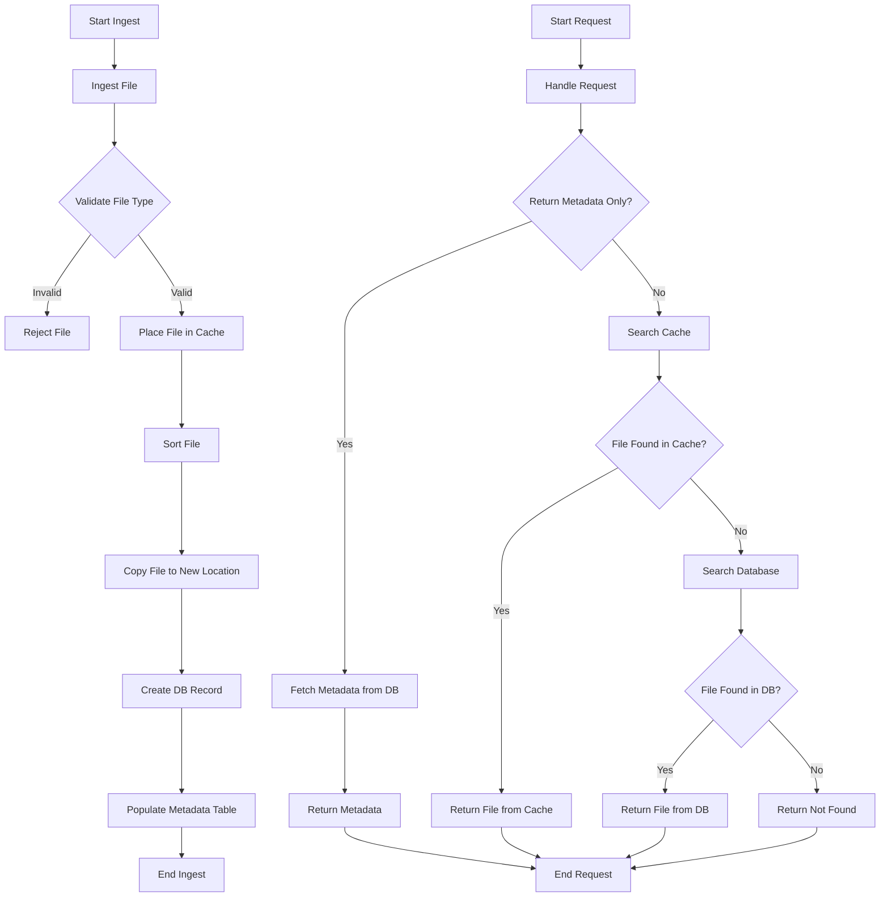

## CrossDocTool

A backend file sorting and storage tool that exposes a RESTful API.

The application is written entirely in Go (Golang), chosen for its balance between simplicity and performance. It offers a clean and efficient development experience while still providing the control, reliability, and speed expected from a compiled language.

Go’s built-in concurrency model—centered around goroutines and channels—makes it particularly well-suited for handling multiple file uploads in parallel without degrading system performance. This allows the application to remain responsive and scalable, even under heavy load.

Additionally, Go’s strong standard library, fast compile times, and straightforward deployment (via static binaries) make it an excellent choice for building and maintaining backend services like this one.

