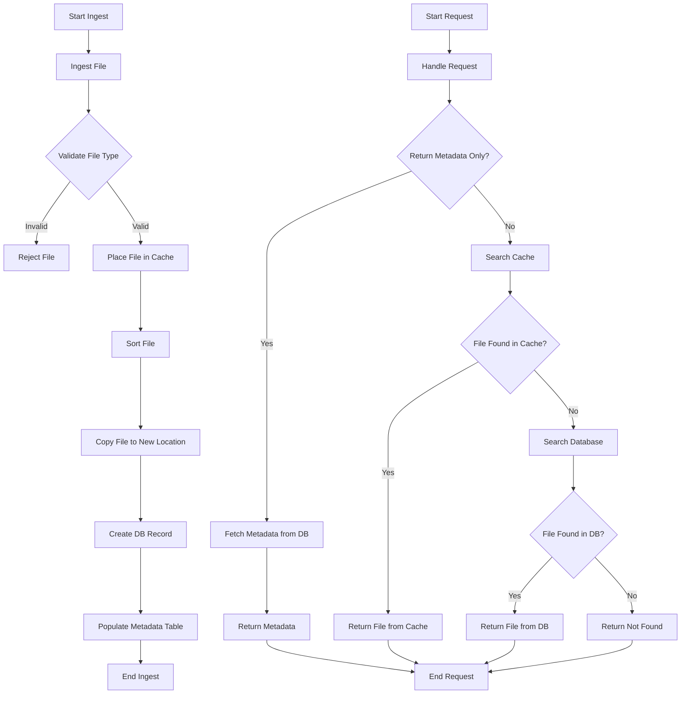

# Dewey

### Overview
Dewey is a backend file sorting and storage tool that exposes a RESTful API for interactions. For each file uploaded, a database entry is created storing critical file and ACTS information as well as metadata. Speed and performance is a top priority, with the goal of being stable on the lowest possible hardware resources.

#### Features
- Self-backups for rollbacks
- Binary/executable file rejections
- File type and size restrictions
- Prometheus metrics, custom graphing, and an administration portal
- HTTP rate limiting
- IP allowlisting for known machines, with per-request access logging
- Lua-based plugin system for custom sorting/filtering logic
- In-app documentation for both developers and administrators
- (Planned) plugin validation
- (Planned) self restart and cleanup

### Technology Stack
The application's backend is written entirely in Go (Golang), chosen for its balance between simplicity and performance. It offers a clean and efficient development experience while still providing the control, reliability, and speed expected from a compiled language. Go allows for fast development and a shallow learning curve.

Go’s built-in concurrency model—centered around goroutines and channels—makes it particularly well-suited for handling multiple file uploads in parallel without degrading system performance. This allows the application to remain responsive and scalable, even under heavy load.

Additionally, Go’s strong standard library, fast compile times, and straightforward deployment (via static binaries) make it an excellent choice for building and maintaining backend services like this one.

Svelte is used for the frontend, providing a reactive and efficient user interface. It allows for a smooth, modern developer experience while maintaining a simple syntax similar to HTML. Separating the frontend and backend allows for easier maintenance, scalability, and a modern website feature-set.

#### External Libraries
Gin - A Go web framework for building RESTful APIs
Gozxing - A Go library for reading and writing barcode images
Go-sqlite3 - A Go library for SQLite3 database access (SQLite3 was picked for its simplicity and ease of use)
GopherLua - A Go native Lua VM (used for plugins, which handle file sorting/filtering)
Prometheus client_golang / go-gin-prometheus - Metrics collection and exposition
golang.org/x/time - Token-bucket rate limiting for the HTTP API

#### Portability
The application and its supporting software are built into a Podman (a Docker alternative) container. This allows for easy cross-platform deployment, scaling, and portability. Podman containers allow for control over security and resource allocation.

