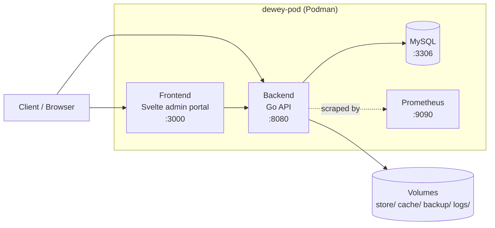

# Dewey — Developer Guide

Architecture, API, plugins, database, and deployment reference for engineers.

## Table of Contents
- [Overview](#overview)
- [Architecture](#architecture)
- [Tech Stack](#tech-stack)
- [API Reference](#api-reference)
- [CLI Tool](#cli-tool)
- [MCP Server](#mcp-server)
- [Testing Tools](#testing-tools)
- [Access Control](#access-control)
- [Plugin System](#plugin-system)
- [Database](#database)
- [Daemon](#daemon)
- [Logging](#logging)
- [Configuration](#configuration)
- [Deployment](#deployment)
- [Troubleshooting](#troubleshooting)

## Overview

Dewey is a backend document management and file sorting service. It exposes a REST API for file ingestion, retrieval, and deletion. On upload, each file is validated, scanned for barcodes, run through a Lua plugin chain, copied to permanent storage, and recorded in a MySQL database alongside its metadata.

The admin portal (frontend) is a SvelteKit application that provides a real-time analytics dashboard, settings management, and in-app docs.

## Architecture

### File Ingest Pipeline

Every uploaded file passes through a staged pipeline before it is permanently stored:

1. **Receive** — `multipart/form-data` POST to `/upload`. File and metadata fields are extracted.
2. **Validate** — extension checked against an allowlist; file header bytes checked for PE (Windows) and ELF (Linux) executable signatures. Both checks must pass.
3. **Cache** — file is written to `./cache` with a Unix timestamp prefix to avoid collisions. SHA-256 hash is computed.
4. **Barcode scan** — the cached file is scanned via gozxing. Result stored in the DB entry.
5. **OnUpload plugins** — a tag-only notification hook (can't veto the upload), able to mutate metadata such as `entry.Meta`.
6. **OnFilter plugins** — all registered OnFilter plugins run in salience order, each able to mutate the file's destination path.
7. **Store** — file is copied from cache to `./store` at the path determined by the plugin chain.
8. **Record** — a row is inserted into the `files` table and a row into the `meta` table.

### File Retrieval

`GET /files/:filename/false` — checks cache first; falls back to a DB path lookup. Returns the file stream directly.
`GET /files/:filename/true` returns the file's metadata record as JSON instead of streaming its bytes.

### Deployment Topology

Dewey runs as four containers inside a single Podman pod, sharing a network namespace so they can reach each other over `localhost`:



## Tech Stack

**Backend**
- **Go** — compiled, statically typed. Goroutines handle concurrency. Fast build and single-binary deployment.
- **Gin** — HTTP router and middleware framework.
- **MySQL** — primary datastore via `database/sql` with connection pooling.
- **GopherLua** — embedded Lua VM for the plugin system.
- **gozxing** — barcode/QR decoding.
- **go-gin-prometheus** — Prometheus metrics middleware.

**Frontend**
- **SvelteKit** — file-based routing, SSR-capable, reactive runes (`$state`, `$derived`).
- **Tailwind CSS** — utility-first styling with dark mode support.
- **Flowbite-Svelte** — UI component library.

**Infrastructure**
- **Podman** — container runtime (Docker-compatible). All services run in a single Pod.
- **Prometheus** — metrics scraping and storage.

## API Reference

All endpoints are served on port `8080`. Plugin and DB context is injected into every handler via Gin middleware. Every route also passes through the [Access Control](#access-control) allowlist first.

| Method | Path | Handler | Description |
|---|---|---|---|
| GET | `/` | `index` | Health check. Returns server status and Unix timestamp. |
| GET | `/version` | `versionInfo` | Returns the backend's release version and the git branch it was built from. |
| POST | `/upload` | `uploadFile` | Upload a file with metadata fields. Accepts `multipart/form-data`. |
| GET | `/files` | `listFiles` | List all filenames currently in the upload cache. |
| GET | `/files/:filename/:meta` | `getFile` | Retrieve a file by name. Set `:meta` to `false` for file stream, `true` for metadata JSON. |
| DELETE | `/files/:filename` | `deleteFile` | Remove a file from the cache directory. |
| POST | `/files/move/:currentfilepathandname/:newfilepathandname` | `moveFile` | Move/rename a stored file and update its DB `filepath` (issue #333). **Known broken:** gin's `:param` can't contain `/`, so any real subfolder path 404s, and `MoveFile` doesn't prefix `fileSystemBaseDir`, so even a bare filename hits the container's read-only root instead of the `store/` volume. |
| GET | `/admin` | — | Serves the admin portal HTML page. |
| GET | `/settings` | — | Serves the settings HTML page. |
| GET | `/admin/dumpCache` | `triggerCacheDump` | Immediately clear all files from the cache directory. |
| GET | `/admin/reloadPlugins` | `reloadPlugins` | Reload plugins from disk unconditionally, without restarting the server. |
| GET | `/machines` | `listMachines` | List every machine registered in the `known_machines` allowlist. |
| POST | `/machines` | `addMachine` | Register a new machine. Body: `{"ip": "...", "label": "..."}`. |
| DELETE | `/machines/:ip` | `deleteMachine` | Remove a machine from the allowlist by IP. |

### Upload — Form Fields

`POST /upload` expects `multipart/form-data` with the following fields:

| Field | Type | Notes |
|---|---|---|
| `file` | File | Required. The file to upload. |
| `claim_number` | string | Claim identifier. |
| `claimant_name` | string | Full name of the claimant. |
| `date_of_injury` | string | Date of injury. |
| `employer` | string | Employer name. |
| `adjuster` | string | Adjuster name. |
| `support` | string | Support contact. |
| `claim_type` | string | Type of claim. |
| `jurisdiction` | string | Jurisdiction. |
| `policy_number` | string | Insurance policy number. |
| `acts_id` | string | ACTs system ID. Used as the foreign key linking files to metadata. |

### Allowed File Types

Files with any other extension are rejected with `400 Bad Request`. Files are also checked for PE and ELF executable magic bytes regardless of extension.

`.pdf` `.txt` `.doc` `.docx` `.xls` `.xlsx` `.csv` `.ppt` `.png` `.jpg` `.jpeg`

## CLI Tool

`cli/` is a small standalone Go module (`dewey-cli`) that wraps every backend route above, so the API can be exercised during development without reaching for `curl` and hand-built multipart requests.

### Build & run

```bash
cd cli
go build -o dewey-cli .

# Defaults to http://localhost:8080 — override with DEWEY_HOST
DEWEY_HOST=http://<host>:8080 ./dewey-cli health
```

### Commands

| Command | Route | Notes |
|---|---|---|
| `health` | `GET /` | |
| `version` | `GET /version` | |
| `dump_cache` | `GET /admin/dumpCache` | |
| `list_machines` | `GET /machines` | |
| `add_machine <ip> <label>` | `POST /machines` | |
| `delete_machine <ip>` | `DELETE /machines/:ip` | |
| `list_files` | `GET /files` | |
| `get_file <filename>` | `GET /files/:filename/false` | |
| `get_file_meta <filename>` | `GET /files/:filename/true` | |
| `delete_file <filename>` | `DELETE /files/:filename` | |
| `upload <path> [field=value ...]` | `POST /upload` | See metadata fields below. |
| `self_ip` | — | Locally-determined outbound IP toward `DEWEY_HOST` — a starting guess for what to register in Known Machines, not a guarantee (NAT can rewrite the source address in transit). |
| `metrics` | `GET /metrics` | Live terminal metrics dashboard (issue #348). Polls every 5s; `q` to quit, arrows/`jk`/wheel to scroll. |
| `docs <readme\|admin>` | — | Terminal markdown viewer (issue #379) for `README.md` or `frontend/doctooladmin/README.md`, baked into the binary at build time. `q` to quit, arrows/`jk`/wheel to scroll. |
| `soak_test [sim_days] [users] [seconds_per_sim_day]` | — | Runs `soak_test.sh` inside the backend container via `podman exec`. See [Testing Tools](#testing-tools). |

### Upload metadata

`upload` accepts any of the metadata fields above as trailing `field=value` arguments, in any order. Fields left out are simply not sent, same as leaving them blank in the admin portal's upload dialog. An unrecognised field name fails immediately rather than being silently dropped.

```bash
./dewey-cli upload report.pdf \
  claim_number=CL-1024 \
  claimant_name="Jane Doe" \
  acts_id=A-88
```

## MCP Server

`dewey-mcp/` is a standalone Go module implementing an [MCP](https://modelcontextprotocol.io) (Model Context Protocol) server, exposing Dewey and its Podman pod to AI model clients (Claude Desktop, Claude Code, etc.) as a set of callable tools. Unlike the REST API above, it communicates over stdio rather than HTTP — a client spawns the built binary as a subprocess per connection rather than dialing a port.

### Build & run

```bash
cd dewey-mcp
go build -o dewey-mcp .

# Talks to the backend at http://localhost:8080 by default — override with DEWEY_HOST
DEWEY_HOST=http://<host>:8080 ./dewey-mcp
```

Point an MCP client's stdio transport at the built binary to connect — there's no port to publish or firewall rule to open.

### Tools

| Tool | Kind | Description |
|---|---|---|
| `is_up` | read-only | Checks whether the Dewey backend is reachable, via `GET /`. |
| `version` | read-only | Returns the backend's release version and the git branch it was built from. |
| `get_podman_health` | read-only | Status of the `dewey-pod` Podman pod (`podman pod ps`). |
| `get_podman_containers` | read-only | Lists every running Podman container (`podman ps`). |
| `get_podman_container_logs` | read-only | Recent log output of a single container, by name or ID. |
| `restart_podman_container` | destructive | Restarts a single container by name or ID — interrupts whatever it was serving. The only non-idempotent tool here. |
| `create_file` | destructive | Writes contents to a file at `path`, creating or truncating it. |
| `read_file` | read-only | Returns a file's contents. |
| `move_file` | destructive | Moves/renames a file from `src` to `dst`. Skips rather than overwrites if `dst` already exists. |
| `delete_file` | destructive | Removes a file. |

### Path-traversal protection

`read_file`, `move_file`, and `delete_file` resolve every path argument through `resolveSafePath`, which rejects anything that resolves outside the server's working directory — an absolute path or a `../` escape — mirroring the backend's own `resolveStorePath` guard used for uploaded file paths. Without it, any connected MCP client would have unrestricted read/move/delete access to whatever the server process itself can reach on the host.

### Packaging

`package.sh` (repo root) cross-compiles `dewey-mcp` for linux/amd64 and bundles the binary alongside `dewey-cli` in the shipped `.tar.gz`.

## Testing Tools

`backend/testing_tooling/` holds the BIT suite plus two load-generation scripts, all run from inside the backend container so their requests come from an already-allowlisted source:

- **test_suite.py** — the BIT (built-in test) suite: a black-box pass over the whole HTTP API, run automatically at every server startup.
- **load_test.sh** — a fixed-size burst of uploads (plus a retrieval pass) from a single source, done in seconds. Good for a quick sanity check.
- **soak_test.sh** — sustained, multi-user, day/night-shaped traffic over a configurable duration (issue #311).

### BIT suite (test_suite.py)

Runs automatically once the server finishes starting up — backgrounded (`main.go`'s BITs goroutine) so it doesn't block the server from listening. A failure only logs a `Warn`, it doesn't crash the server — this is a self-test, not a startup gate.

```bash
python3 backend/testing_tooling/test_suite.py [base_url]  # defaults to http://localhost:8080

# or, against a running deployment, from inside the backend container:
podman exec cross-doc-tool-dev python3 testing_tooling/test_suite.py
```

Structured `PASS`/`FAIL`/`SKIP` lines go to stdout, human-readable progress to stderr — both are also teed into a timestamped log under `/app/logs/bits/`, a persisted volume that survives a container restart (issue #213).

What it checks, in run order:

1. **Endpoint health** — `/`, `/files`, `/admin/dumpCache` all respond.
2. **JSON upload** — the JSON-only branch of `/upload` accepts valid JSON and rejects malformed JSON.
3. **Multipart upload** — every fixture file type uploads successfully with randomized metadata.
4. **Upload error cases** — a bad content-type and a missing file field are both rejected.
5. **Disallowed extension** — `.sh`/`.exe` uploads are rejected.
6. **ELF rejection** — an ELF binary disguised with a `.txt` extension is still detected and blocked.
7. **PDF JavaScript rejection** — a PDF with an embedded `/OpenAction` trigger is rejected (issue #245).
8. **Path traversal** — `../`-style paths in `GET`/`DELETE` requests are blocked.
9. **SHA256 upload verification** — the server-reported hash in the upload response matches the file's real hash.
10. **Duplicate upload** — uploading the same file twice produces two distinct stored filenames.
11. **Roundtrip integrity** — a downloaded file's hash matches what was uploaded, via `GET /files/:filename/false`.
12. **Store path verification** — checks the store *on disk* for the file, not just through the API (issue #270). Polls briefly (the store copy lands asynchronously, behind `postProcessingSem`), then confirms the store copy's content matches via SHA256.
13. **Metadata retrieval** — `GET /files/:filename/true` returns the expected fields, an unknown `:meta` value gets 400, and a non-existent file gets 404.
14. **Catalog** — `GET /files` lists what was just uploaded.
15. **Delete** — deleting a real file succeeds, and deleting a nonexistent one returns 404.

### Why soak_test.sh exists

The daemon's tick interval reacts to an EMA-smoothed upload/retrieval rate and the active-user count — behavior that only meaningfully diverges from steady state under sustained, *varying* load. A short burst can't exercise that, or the slower trends (cache-clean cadence, memory growth) that only show up over a long run.

### Simulating multiple users

Every container in `dewey-pod` shares one network namespace, so extra containers wouldn't produce distinct source IPs for `ActiveUserCount()` to see. Instead, each simulated user binds its requests to its own loopback alias (`127.0.0.2`, `127.0.0.3`, …) via `curl --interface`, and registers/deregisters that IP through the `/machines` routes at start and exit. The backend genuinely sees a different `RemoteAddr` per user with no network changes required.

### Traffic shape

Each user's request cadence follows a diurnal curve — quiet overnight, busy through the afternoon — rather than firing at a constant rate:

```
multiplier(hour) = floor + (1 - floor) · max(0, sin(π·(hour-9)/12))
interval(hour)   = SECONDS_PER_SIM_DAY / (peak_requests_per_day · multiplier(hour))
```

The bump is positive only for simulated hour 9 through 21, peaking at 15:00; outside that window the rate sits at a low floor rather than stopping outright. The interval is derived as a requests-per-simulated-day target rather than a fixed number of seconds, so the ramp stays meaningful at any compression factor — jittered ±50%, and capped at whatever real time is left in the run so a quiet-hour interval can never sleep past the run's own end.

### Time compression

`SECONDS_PER_SIM_DAY` controls how many real seconds map to one simulated day — the same parameter either way, not a separate "mode". The default, `60`, compresses 30 simulated days into about 30 real minutes. Passing `86400` gives true real-time pacing — useful for an actual multi-day soak run, at the cost of it taking that many real days to finish.

### Metrics log

A separate background loop samples `/metrics` on a fixed real-time cadence (every 10s, independent of compression) and appends one row to `/app/logs/soak_metrics_<run>.csv` — plain CSV, readable directly by a plotting script:

```
timestamp,sim_day,sim_hour,time_til_next_tick,cache_clean_cycles_total,
ram_usage_mb,heap_usage_mb,goroutines,open_fds,connected_users,upload_rate
```

`cache_clean_cycles_total` reads the `app_cache_clean_cycles_total` gauge — a counter incremented once per daemon tick that runs a cache clear, added alongside the other Prometheus metrics so cache-clean cadence is visible over a long run rather than only the current cache size at any one instant.

### Running it

```bash
# via the CLI, from the deploy host
dewey-cli soak_test 30 5 60      # default: 30 sim days, 5 users, 60s/simday
dewey-cli soak_test 7 5 86400    # the real thing: 7 real days, true pacing

# or directly, from inside the backend container
podman exec cross-doc-tool-dev ./testing_tooling/soak_test.sh
```

## Access Control

Dewey runs on a closed network of machines talking to each other — no route is reachable from outside that network. Instead of per-user authentication, access is gated by an IP allowlist: the `known_machines` table, checked by the `logConnections` middleware (`main.go`) ahead of every other handler.

On each request the middleware resolves the caller's address via `resolveClientIP`, which parses `c.Request.RemoteAddr` directly using Go's `net/netip` package rather than gin's own `c.ClientIP()` — the latter calls `net.ParseIP`, which silently returns an empty string for any zone-qualified address (e.g. `fe80::...%eth0`), which is exactly what rootless Podman's `pasta` network helper presents for host-to-forwarded-port connections (issue #315).

Link-local IPv6 addresses (`fe80::/10`) are treated as host-equivalent and skip the allowlist check entirely — only reachable from the local link, and tied to the host's specific network interface rather than something that could be usefully pre-registered the way loopback is. Anything else goes through `checkKnownMachine`: an unregistered IP gets `403 Forbidden` before reaching the route handler, while a registered IP proceeds and `logMachineIP` bumps `last_seen_at` for it — this doubles as the connection log (who talked to the server, and when).

The server calls `r.SetTrustedProxies(nil)` so gin ignores `X-Forwarded-For`/`X-Real-IP` headers — without this, any machine could set that header and spoof its way past the allowlist, since there's no reverse proxy in front of this pod to strip it.

> **Scope:** this is IP-based, not identity-based — there's no login or credential. It stops outside machines from reaching the API cold, but anything already on the network that can claim a registered IP (DHCP collision, static IP reuse) gets full access with no further check. That trade-off is intentional given the closed-network threat model; it is not a substitute for real authentication if Dewey is ever exposed more broadly.

### Managing the allowlist

Machines can be listed, added, and removed via the `/machines` routes above, or through the Known Machines page in the admin portal. Because those routes are gated by the same allowlist, the very first machine can't bootstrap itself through the API — register it directly against `known_machines` (a manual `INSERT`, or a CLI flag if one is added) before anything else can reach the server.

## Plugin System

Plugins are Lua scripts dropped into `./plugins/`. They are loaded at startup by the `PluginManger` against a dynamic registry of hook names Go registers up front — there's no fixed set of plugin "types" baked into the loader. Every plugin exports `WhoAmI`, plus one function per hook it wants to attach to, named exactly after that hook. A single file can implement more than one hook.

Plugins can be added, removed, or edited after startup without restarting the server (issue #325) — see [Daemon](#daemon) for how change-detection and reload work.

### Hooks

| Hook | When it runs |
|---|---|
| `OnUpload` | Once per upload, during async post-processing, before `OnFilter`. Runs after the `200 OK` is already sent, so it can't veto the upload — tag-only (e.g. write into `entry.Meta`). |
| `OnFilter` | Once per upload, during async post-processing. Can mutate the destination path (`entry.Path`). |
| `OnDelete` | Once per delete request, synchronously, before anything is removed. Calling `error(...)` vetoes the deletion — the caller gets a 403 instead. |
| `OnInit` | Once at server startup. Registered and invoked; no shipped example plugin. |
| `OnTick` | Once per daemon tick. `OnTick.lua` fetches NOAA's planetary K-index (`http.get`), caches it to the plugin scratch directory (`files.write`), reads the cache back (`files.read`), and beacons it out (`http.post`). |

Within a hook, plugins run in descending salience order (highest first), each in its own isolated Lua state (via a per-plugin `sync.Pool`) so one plugin's globals can't leak into another's.

### Plugin Structure

`WhoAmI` reports salience only — which hook(s) a plugin attaches to comes entirely from the hook-named functions it defines, e.g. `OnFilter(entry)`:

```lua
-- Salience determines this plugin's run order relative to other OnFilter
-- plugins (higher runs first). WhoAmI reports salience only — which hook
-- this plugin attaches to comes from the OnFilter function name below.
Salience = 10

function WhoAmI()
    return Salience
end

-- OnFilter receives the file entry table and returns a (possibly modified)
-- copy.
function OnFilter(entry)
    -- entry.Filename  — timestamped filename (e.g. "1700000000_report.pdf")
    -- entry.Act       — ACTs ID from upload metadata
    -- entry.Hash      — SHA-256 hash of the file
    -- entry.Path      — destination path (OnFilter should modify this)
    -- entry.Meta      — metadata string
    -- entry.Barcode   — decoded barcode text, or nil if none found

    -- Example: sort PDFs into a subdirectory
    if string.match(entry.Filename, "%.pdf$") then
        entry.Path = "pdf/" .. entry.Filename
    end

    return entry
end
```

### Salience

`WhoAmI`'s return value is the salience. Higher numbers run first. Use salience to control ordering when multiple plugins attach to the same hook. Plugins with equal salience run in an undefined order.

### Sandboxing & Capability API

A plugin's Lua state only has `base`, `string`, and `table` opened — no `os`, `io`, or `math`, and the base-library globals that could reconstruct that access (`load`, `loadstring`, `dofile`, `loadfile`, `require`, `getfenv`, `setfenv`) are stripped out too (issue #284, superseding #199, which had found `lua.NewState()` running with the full stdlib open — full shell access from any `.lua` file dropped into `plugins/`).

In place of raw `os`/`io`, plugins get two narrow, Go-implemented capability APIs — the only way for one to reach the network or filesystem:

| Function | Does | Restriction |
|---|---|---|
| `http.get(url)` | GET request, returns the response body as a string | Refuses to dial loopback/private/link-local/unspecified IPs — checked against the actually-resolved IP at dial time, not just the URL's hostname, closing a DNS-rebinding gap. MySQL and Prometheus are deliberately unpublished from the LAN (#200, #204) with no auth of their own; this is what stops an unrestricted plugin HTTP client from being a direct SSRF path back into both. |
| `http.post(url, body)` | POST request with `body`, returns the response body as a string | Same restriction as `http.get`. |
| `files.read(name)` | Reads a file, returns its contents as a string | Confined to `pluginScratchDir` (`./plugin-scratch`, separate from `store`/`cache`/`backup`) via the same traversal check (`resolveStorePath`) that keeps uploads inside `fileSystemBaseDir` — a `../` escape is rejected before any file is touched. |
| `files.write(name, data)` | Writes `data` to a file | Same restriction as `files.read`. |

A Go-side error on any of these four raises a normal Lua error, catchable with `pcall` like any other plugin error.

## Database

MySQL. Connection string is read from the `DB_DSN` environment variable. Falls back to `root:dewey@tcp(127.0.0.1:3306)/deweyRecords` for local development. Schema is applied automatically on startup via `Migrate()`.

### files

| Column | Type | Notes |
|---|---|---|
| `id` | INT AUTO_INCREMENT | Primary key. |
| `filename` | VARCHAR(255) | Timestamped filename as stored on disk. |
| `acts_id` | VARCHAR(100) | Foreign reference to the `meta` table. Indexed. |
| `sha256_hash` | CHAR(64) | SHA-256 of the file content at upload time. |
| `created_at` | VARCHAR(35) | RFC3339 timestamp of ingest. |
| `filepath` | TEXT | Path within `./store` as set by the plugin chain. |
| `is_deleted` | TINYINT(1) | Soft delete flag. 0 = active, 1 = deleted. |
| `barcode` | VARCHAR(100) | Decoded barcode text, or NULL if none found. |

### meta

| Column | Type | Notes |
|---|---|---|
| `id` | INT AUTO_INCREMENT | Primary key. |
| `claim_number` | VARCHAR(100) | Indexed for fast lookup. |
| `claimant_name` | VARCHAR(255) | |
| `date_of_injury` | DATE | |
| `employer` | VARCHAR(255) | |
| `adjuster` | VARCHAR(255) | |
| `support` | VARCHAR(255) | |
| `claim_type` | VARCHAR(100) | |
| `jurisdiction` | VARCHAR(100) | |
| `policy_number` | VARCHAR(100) | |
| `acts_id` | VARCHAR(100) | Links to `files.acts_id`. Indexed. |

Deletes are soft — the `is_deleted` flag is set to `1` rather than the row being removed. All queries filter on `is_deleted = 0`.

### known_machines

Backs the [Access Control](#access-control) allowlist.

| Column | Type | Notes |
|---|---|---|
| `id` | INT AUTO_INCREMENT | Primary key. |
| `ip` | VARCHAR(45) | Unique. Source IP checked on every request. Sized for IPv4 and IPv6. |
| `label` | VARCHAR(255) | Human-readable name for the machine (e.g. "vm-2"). |
| `added_at` | DATETIME | Defaults to the time the machine was registered. |
| `last_seen_at` | DATETIME | Updated on every authorized request from this IP. NULL until first seen. |

## Daemon

A background goroutine (`startDaemon`) fires every `daemonTickTime` hours. On each tick it:

1. Clears all files from `./cache` (`dumpCache`).
2. Creates a timestamped zip of `./store` in `./backup` (`save`).
3. Checks whether the plugin directory changed since the last tick (`HavePluginsChanged`, SHA-256 hash per file) and reloads plugins (`ReloadPlugins`) only if something was added, removed, or edited — issue #325.
4. Runs all registered `OnTick` plugins.

`ReloadPlugins` resets loaded plugins and hook attachments and re-runs `LoadPlugins`, but leaves the registered hook *names* (`OnUpload`, `OnFilter`, etc.) untouched — those are declared once at startup (`main.go`), not per-load state. The same reload can also be forced on demand via `GET /admin/reloadPlugins`, which reloads unconditionally rather than checking for changes first.

The daemon uses an `observableTicker` wrapper around `time.Ticker`, which exposes `Remaining()` — the time until the next tick. This is surfaced via the `TimeUntilNextTick()` helper for use in API responses or metrics. The daemon stops cleanly when the server context is cancelled.

## Logging

A custom logger in `log.go` writes to both the terminal and a date-rotating log file in `./logs/`. Terminal output is colourised; file output is plain text.

| Function | Level | Use for |
|---|---|---|
| `Debug(msg)` | DEBUG | Verbose internal state, low noise in production. |
| `Info(msg)` | INFO | Key lifecycle events. |
| `Warn(msg)` | WARN | Recoverable errors — plugin failures, file not found, etc. |
| `Fatal(msg)` | FATAL | Unrecoverable errors. Closes the log and calls `os.Exit(1)`. |
| `Ok(msg)` | — | Green checkmark for startup success events. Terminal only. |
| `Section(title)` | — | Styled divider for separating startup phases. Terminal only. |
| `Banner()` | — | Startup banner. Called once after `InitLogger`. |

Log files rotate daily. The filename format is `logs/app-YYYY-MM-DD.log`. Initialise the logger with `InitLogger("logs", "app")` and defer `logger.Close()`.

## Configuration

Defaults live in `backend/config.json`, read once into these package-level vars at startup by `load()` (`consts.go`). There's no runtime override endpoint — changing a value means editing `config.json` and redeploying.

| Constant | Default | Description |
|---|---|---|
| `uploadDir` | `./cache` | Temporary landing directory for uploaded files. |
| `fileSystemBaseDir` | `./store` | Permanent storage root. Plugins set paths relative to this. |
| `backupDir` | `./backup` | Destination for zip backups created on each daemon tick. |
| `daemonTickTime` | 1 (minute) | Base interval between daemon ticks (cache clear + backup); `computeTickInterval` scales this up under active load — see [Daemon](#daemon). |
| `alpha` | 1 | Tick-scaling: extra seconds added per active user. |
| `beta` | 1 | Tick-scaling: extra seconds added per unit of smoothed upload/retrieval rate. |
| `tBase` | 5 | Tick-scaling: baseline interval in seconds when the system is idle. |
| `tickMax` | 500 | Tick-scaling: upper bound (seconds) the computed interval is clamped to. |
| `tickMin` | 1 | Tick-scaling: lower bound (seconds) the computed interval is clamped to. |
| `maxFileSize` | 50 MB | Maximum upload size enforced by the HTTP server. |
| `portNumber` | 8080 | Port the backend listens on. |
| `appVersion` | 0.3.0 | App release version shown in the dashboard topbar; bumped by hand per release. |
| `rateLimitPerSecond` | 80 | Global (not per-IP) token-bucket refill rate, in requests/second — shared across every client hitting the server. |
| `rateLimitBurst` | 120 | Burst allowance on top of the refill rate, also shared globally. |
| `maxOpenDBConnections` | 10 | Max simultaneous open DB connections. |
| `maxIdleDBConnections` | 10 | Max idle connections kept in the pool. |
| `dbConnectionTimeoutMultiplier` | 2 (min) | Connection lifetime before it is recycled. |
| `pluginDir` | `./plugins` | Directory scanned for Lua plugin files at startup. |
| `pluginScratchDir` | `./plugin-scratch` | Sandbox directory plugins' `files.read`/`files.write` are confined to — kept separate from `store`/`cache`/`backup` so a plugin can never reach a user's actual documents. |
| `maxConcurrentPostProcessing` | 4 | Max concurrent post-processing goroutines (barcode scan + Lua plugins + disk copy) an upload burst can run at once. |

### Environment Variables

| Variable | Description |
|---|---|
| `DB_DSN` | MySQL data source name. If unset, defaults to the local dev DSN. |
| `DEWEY_POD_CPUS` | Pod CPU resource limit override for `deploy.sh` (default: `4`). |
| `DEWEY_POD_MEMORY` | Pod memory resource limit override for `deploy.sh` (default: `4g`). |

## Deployment

All services run in a single Podman Pod. The `deploy.sh` script at the repo root handles the full build and launch sequence.

### Services in the Pod

- **Backend** — Go binary, port 8080
- **Frontend** — Node/SvelteKit, port 3000
- **Prometheus** — metrics scraper, port 9090
- **Database** — MySQL (managed externally or as a container)

### Quick deploy

```bash
bash deploy.sh
# Wipe the mysql-data volume before starting (opt-in — normally data persists):
bash deploy.sh --reset-db
```

### Persistence

`deploy.sh` mounts named Podman volumes so data survives a pod recreation instead of living only in a container's writable layer:

- `mysql-data` → `/var/lib/mysql`
- `dewey-store` → `/app/store`
- `dewey-cache` → `/app/cache`
- `dewey-backup` → `/app/backup`
- `dewey-logs` → `/app/logs`
- `prometheus-data` → `/prometheus` (Prometheus's own metrics history; always persists, untouched by any of the flags below)

`--reset-db` and the store/cache wipe (`--keep-data` / `--wipe-data`) are independent — running one without the other can leave the database pointing at files that no longer exist on disk, or files on disk with no database record. `--clean-slate` forces both wipes together instead, gated behind a typed `yes` confirmation at an interactive terminal (it refuses to run non-interactively, since this permanently destroys every stored file and its metadata):

```bash
bash deploy.sh --clean-slate
```

`package.sh`'s generated `run.sh` uses `podman play kube --replace`, so redeploying a new bundle on the server doesn't require tearing the pod down first — and `--replace` leaves the named volumes untouched, so data carries over between deploys there too.

### Deploy flags & resource limits

- `--reset-db` — wipes `mysql-data` before starting MySQL (`deploy.sh` only).
- `--keep-data` / `--wipe-data` — controls wiping store, cache, backup, and log volumes.
- `--clean-slate` — interactive full wipe of both database and data volumes (`deploy.sh` only; requires typed confirmation).
- `--app-only` — swaps backend and frontend containers in place without restarting MySQL or Prometheus.
- `DEWEY_POD_CPUS` / `DEWEY_POD_MEMORY` — environment variable overrides for pod resource limits (defaults: `4` CPUs, `4g` memory).

Bundled `run.sh` supports `--keep-data`, `--wipe-data`, and `--app-only`, but neither `--reset-db` nor `--clean-slate` has a `run.sh` equivalent because it never touches `mysql-data`. Wiping the database on a bundled deployment requires running `podman volume rm mysql-data` manually.

### Manual build — backend

```bash
podman build \
  --build-arg CGO_CFLAGS="-Wno-discarded-qualifiers" \
  -t dewey-backend ./backend

podman run -d --pod dewey-pod \
  -e DB_DSN="user:pass@tcp(host:3306)/deweyRecords" \
  --name dewey-backend dewey-backend
```

### Manual build — frontend

```bash
podman build -t dewey-frontend ./frontend/doctooladmin
podman run -d --pod dewey-pod --name dewey-frontend dewey-frontend
```

The backend binary expects `./plugins`, `./cache`, `./store`, and `./backup` to be writable. Mount these as volumes if you need data to persist across container restarts.

## Troubleshooting

### Deployment & Networking Gotchas

**1. HOST_IP fallback to literal "localhost"**

When `hostname -I` returns nothing (e.g. an isolated host or CI container), `deploy.sh` defaults `HOST_IP` to the literal string `"localhost"` and inserts it into `known_machines`. Because client requests are evaluated against parsed numeric IP addresses (`127.0.0.1` or `::1`), `"localhost"` is a dead allowlist entry that will never match incoming traffic. Register the host's actual IP address or loopback (`127.0.0.1`) in `known_machines` manually.

**2. Podman NAT source-IP mismatch**

Rootless Podman networking backends (such as netavark or pasta) can translate connections from the host to published container ports under an internal bridge or gateway IP rather than `HOST_IP`. If health checks or client requests return `403 Forbidden`, inspect the backend logs:

```bash
podman logs cross-doc-tool-dev
```

Look for the "unregistered machine" log line to find the exact source IP received by the server, and register that address via `dewey-cli add_machine <ip> <label>`.

**3. IPv4 vs. IPv6 localhost resolution**

On dual-stack operating systems, connecting to `http://localhost:8080` may resolve to IPv6 loopback (`::1`) before trying IPv4 (`127.0.0.1`). If only `127.0.0.1` is allowlisted, requests to `localhost` will be blocked with `403 Forbidden`. Ensure both `127.0.0.1` and `::1` are present in `known_machines`, or explicitly connect to `http://127.0.0.1:8080`.
